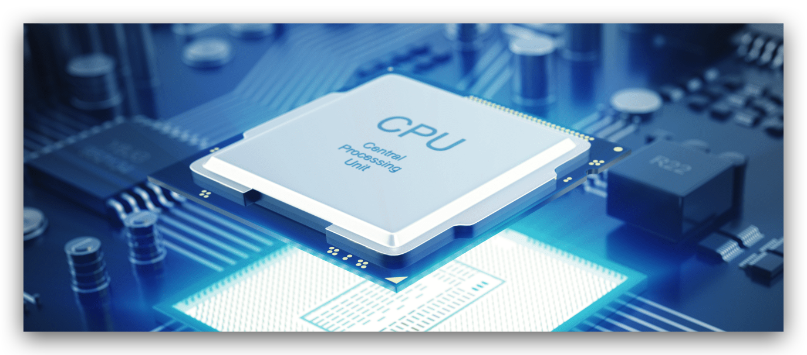

## CPU 概况

CPU 是英文 Central Processing Unit (中央处理器) 的缩写，主要功能是用来解释和运行最终转换成机器语言的程序内容。CPU 相当于计算机的大脑，内部由数百万以及数亿个晶体管构成。了解和熟悉 CPU 对了解程序是如何运行以及理解多线程都有很大帮助。

CPU 和内存都是由许多晶体管组成，通常称为 IC (Integrated Circuit ，集成电路)。从功能上可以把 CPU 划分为 4 部分：寄存器、控制器、运算器和时钟，也有些计算机的时钟设计在 CPU 外部。各部分之间由电流信号相互连通，各部分的功能通过名字我们也能知道大概。在程序员眼中，其实大可把 CPU 看做寄存器的集合体，其他部分可以不用太过关注。

## 汇编

汇编语言 (assembly) 采用**助记符**来编写程序，例如 mov 和 add 分别是数据的存储 (move) 和相加 (addition) 的简写，每一个原本是电气信号的机器语言 (注意汇编语言并不是机器语言，机器语言是 CPU 直接能解释和运行的语言)都会有一个与其相对于的助记符，所以汇编语言和机器语言基本上市一一对应的。**通常将汇编写的程序转化成机器语言的过程称为汇编，反过来称为反汇编。**

## 寄存器与 CPU 指令

每种类型的 CPU 内部都有大量的寄存器，寄存器的种类则通过名字来区分，例如 eax 、ebp 都是 CPU 内部的寄存器的名称，而内存的存储场所通过地址编号来区分。根据功能，寄存器大致可以划分为八大类：

<table>
<thead>
<tr>
  <th align="left">种类</th>
  <th align="left">功能</th>
</tr>
</thead>
<tbody>
<tr>
  <td align="left">累加寄存器</td>
  <td align="left">存储执行运算数据和运算后的数据</td>
</tr>
<tr>
  <td align="left">标记寄存器</td>
  <td align="left">存储运算后的 CPU 状态</td>
</tr>
<tr>
  <td align="left">程序寄存器</td>
  <td align="left">存储下一条指令的内存地址</td>
</tr>
<tr>
  <td align="left">基址寄存器</td>
  <td align="left">存储数据内存的起始地址</td>
</tr>
<tr>
  <td align="left">变址寄存器</td>
  <td align="left">存储基址寄存器的相对地址</td>
</tr>
<tr>
  <td align="left">通用寄存器</td>
  <td align="left">存储任意数据</td>
</tr>
<tr>
  <td align="left">指令寄存器</td>
  <td align="left">存储指令，CPU 内部使用，程序员无法通过程序对该寄存器进行读写操作</td>
</tr>
<tr>
  <td align="left">栈寄存器</td>
  <td align="left">存储栈区的起始地址</td>
</tr>
</tbody>
</table>

有了这些寄存器，再加上内存，以及一些 CPU 指令，CPU 就能把程序运行起来了；尽管高级语言的功能和概念非常多，但最后被翻译成机器语言后，CPU 能执行的指令就那么几种：

<table>
<thead>
<tr>
  <th align="left">CPU 指令种类</th>
  <th align="left">功能</th>
</tr>
</thead>
<tbody>
<tr>
  <td align="left">数据转送指令</td>
  <td align="left">寄存器和内存、内存和内存、寄存器和外围设备之间的数据读写操作</td>
</tr>
<tr>
  <td align="left">运算指令</td>
  <td align="left">用累加寄存器执行算数运算、逻辑运算、比较运算和移位运算</td>
</tr>
<tr>
  <td align="left">跳转指令 (jump)</td>
  <td align="left">实现条件分支 (if)、循环(for)、强制跳转等</td>
</tr>
<tr>
  <td align="left">函数调用和返回指令 (call/return)</td>
  <td align="left">函数调用/返回调用前的地址</td>
</tr>
</tbody>
</table>

另外，在[数组下标从零开始计数](https://www.xiaobotalk.com/archives/426)提到的数组寻址公式：

> a[i]_address = base_address + i * type_size

我们可以对主存上的特定的内存区域进行划分，然后用 CPU 的**基址寄存器**和**变址寄存器**很形象的实现类似数组的操作。

## 操作系统对 CPU 的调度

CPU 资源是十分昂贵的，如果高效的使用 CPU ，不让 CPU 空闲是计算机发展的一大见证之一。

**1：多道程序**
多道程序的方法是比较早期的计算机，对 CPU 的调度使用方法。基本原理是编写一个监控程序，当某个程序暂时无法使用 CPU 的时候，监控程序就把其他正在等待 CPU 的程序启动，使得 CPU 被充分利用。但这种方式对各个程序部分轻重缓急，如果某个程序一直使用 CPU，那么其他更重要的程序就得等待(例如用户交互)。

**2：分时系统**
对多道程序进行稍微改进，程序运行模式就变成了一种协作模式，即每个程序运行一定的时间后，都主动让出 CPU 给其他程序，使得一段时间内每个程序都有机会运行一小段时间。这种程序协作模式叫做**分时系统(Time-Sharing System)**。

分时系统虽然对多道程序有所改进，但依然存在计算机假死现象，如果某个程序进入一个死循环，一直霸占着 CPU 不放，那么操作系统也没办法。所以多任务系统就诞生了。

**3：多任务系统**
在多任务系统中，所有的应用程序都以进程的方式运行，每个进程都有自己的地址空间，使得进程之间地址空间相互隔离。操作系统接管了所有的硬件资源，CPU 也由操作系统进行分配，每个进程根据优先级的高低都有机会得到 CPU ，如果运行时间过长，操作系统会暂停该进程，把 CPU 让给其他等待运行的进程。这种 CPU 分配方式也就是所谓的 抢占式。操作系统可以强制剥夺 CPU 的资源并且分配给它认为需要的进程。如果操作系统分配给每个进程的时间都很短，即 CPU 在多个进程间快速地切换，从而造成了很多进程都在同时运行的假象。目前几乎所有的现代的操作系统都是采用这种方式。

(完)